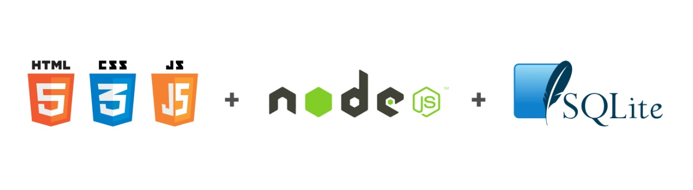

<p align="center">
    
</p>

# Introduction to web development 
This project aims at the practical application of the contents studied on web development through the WorkshopDev given by Rocketseat.

### Project brief
This web application has the purpose of seeking ideas for what to do at home in the quarantine caused by COVID-19. The application has several sections. The home page has a brief explanation of the application and also has a list of the latest ideas posted. The user can post a new idea by pressing the "Adicionar ideia" button, where a modal will appear asking for the information of the new idea. The ideas page lists all registered ideas and also has the possibility to post a new idea just like the home page.

### First Steps

Initially, clone the repository:

```
git clone https://github.com/viniciuslima-99/introduction-to-web-development.git
```

## Technology

### Front-end

* **[HTML](https://developer.mozilla.org/docs/Web/HTML/HTML5)** -  HyperText Markup Language(HTML) is a markup language for the World Wide Web and is a key Internet technology, originally proposed by Opera Software. It is the fifth version of the HTML language.
* **[CSS](https://developer.mozilla.org/docs/Web/CSS)** - Cascading Style Sheets (CSS) is a mechanism for adding style to a web document. It is the third version.
* **[Javascript](https://developer.mozilla.org/docs/Web/JavaScript)** - JavaScript is a structured interpreted programming language, high-level script with weak dynamic typing and multi-paradigm.

### Back-end

* **[Node](https://developer.mozilla.org/en-US/docs/Learn/Server-side/Express_Nodejs)** - An asynchronous event driven JavaScript runtime, designed to build scalable network applications.
* **[Sqlite](https://developer.mozilla.org/en-US/docs/Mozilla/Thunderbird/Thunderbird_extensions/HowTos/Common_Thunderbird_Extension_Techniques/Use_SQLite)** - SQLite is a C language library that implements an embedded SQL database. Programs that use the SQLite library can access the SQL database without running a separate DBMS process. 

## GitHub

### Branches
They can be:
+ master
+ feature
+ bugfix
+ hotfix

Their names must follow this template: `feature/branch-name`

### Commits
Must begin with the name of the branch you developed on, following the model: _“Feature(name-of-feature) : What was done…”._

Must be simple and show briefly what you just did.

- Ex: `git commit -m “Feature(issue_name) : Added ...”`
- Ex: `git commit -m “Bugfix(issue_name) : Changed ...”`
- Ex: `git commit -m “Hotfix(issue_name) : Fix ...”`

### Pull Requests
First, proceed with _rebase_:
1. _commit_ the changes on your branch
2. Go to the original branch (master) with `git checkout master`
3. Run `git pull`
4. Go back to your branch with `git checkout "your-branch"`
5. Run `git rebase master`
6. Follow the steps to conclude the _rebase_, solving conflicts and running `git add .` and then `git rebase --continue`
7. When finished rebasing, run `git push -f origin "your-branch"`. Now your Pull Request can be opened on GitHub.

Use this template for the pull request body:
```
### Issue Name
**What I did:**

- First thing I did...

- Second thing I did...

**How to test:**

- First step to execute the project...

- Second step to execute the project...

```

```markdown
Made with `markdown` and love by Vinícius Lima
```